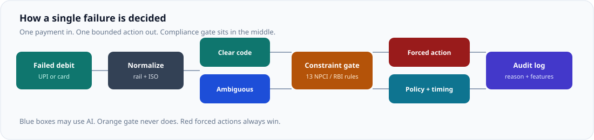
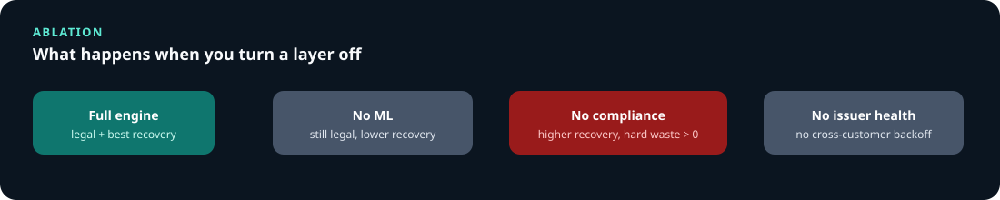

<div align="center">

# Railwise

### Constraint-First Recovery Engine for Failed Recurring Payments in India

<br />


<br />

[](https://razorpay.com/buildathon/)


<br />


<br />

**When a recurring payment fails, the next action is not obvious.**<br />
Retrying too soon breaks NPCI rules. Retrying a stolen card wastes an attempt. Waiting during an SBI spike saves the debit.<br />
Treating every `do_not_honor` the same treats SBI and HDFC as the same bank. They are not.

<br />

[Getting Started](#getting-started) · [Architecture](#architecture) · [Measured Results](#measured-results) · [Edge Cases](#edge-cases) · [References](#references)

</div>

---

## The Problem

India processes over **800 million UPI AutoPay presentations per month** ([NPCI UPI AutoPay data, 2025–26](https://dataful.in/datasets/22491/)). Approval rates at several issuers remain below 50%. Most failures are business declines (insufficient funds, limits, stale mandates), but technical declines cluster when an issuer is under load.

Three structural facts shape this problem:

| Fact | Source | Why it matters |
|------|--------|----------------|
| **UPI AutoPay allows 1 original + 3 retries per cycle** | [NPCI OC/215A](https://www.npci.org.in/what-we-do/upi-autopay/product-overview) | A wasted retry on a hard decline is permanent |
| **SBI's technical decline rate can be 100× HDFC's** | NPCI bank-wise execution data | Same ISO code, very different meaning |
| **Pre-debit notification is mandatory 24h before debit** | [RBI E-mandate Framework 2026](https://www.rbi.org.in/Scripts/NotificationUser.aspx?Id=13374&Mode=0) | Missing it makes the entire debit illegal |

Razorpay already recovers a meaningful slice of these failures. [Intelligent Retry](https://razorpay.com/upi-autopay/) delivers **+8% debit collections** with payday and off-peak timing within NPCI-legal windows. [Intelligent Revenue-Protect](https://razorpay.com/blog/upi-autopay-with-intelligent-revenue-protect/) adds WhatsApp recovery and configurable retry templates.

Railwise does not replace that work. It deepens the **decision** after a failure: rail-specific ceilings, issuer-wide backoff, mandate vitality scoring, and an auditable call on ambiguous ISO codes. The gap it fills is the lattice between the rules: same code but different issuer, same recoverability but exhausted budget, same customer but a dying mandate.

---

## Architecture

### How a Single Failure Is Decided

One failed payment enters. Six stages run. The output is a bounded action plus a commit-style audit log.

<p align="center">
  
</p>

| Stage | What it does | Uses AI? |
|-------|-------------|----------|
| **Ingest** | Normalize UPI and card webhooks into one schema | No |
| **Classify** | Map decline to soft / hard / regulatory / ambiguous | Only for ambiguous codes |
| **Constraints** | Apply 13 NPCI, RBI, and scheme ceilings | Never |
| **Policy** | Choose among remaining legal actions | Timing rank only |
| **Execute** | Deterministic simulated collection | No |
| **Audit** | Full reason chain, feature importance, guideline | No |

> **Compliance always beats recoverability.** If the UPI budget is exhausted, a recoverability score of 0.78 still cannot place another debit. That is the entire product thesis.

### Constraint Priority Order

These 13 constraints are evaluated in strict order. A higher constraint always overrides a lower one.

<p align="center">
  
</p>

### What Railwise Adds

| Capability | What it does | Why standard retry can miss it |
|-----------|-------------|-------------------------------|
| **Issuer Health Monitor** | Detects SBI/Bandhan outages from cross-customer TD spikes; triggers adaptive backoff | A spike means 50,000 mandates fail at once. Retrying all of them worsens the outage. |
| **Mandate Vitality Scorer** | Scores mandate health from failure streaks and days since success; routes dying mandates to dunning early | A mandate that has failed 7 times over 120 days will almost certainly not pay on attempt 8. |
| **ISO 8583 Decline Taxonomy** | Maps 20+ decline codes to soft / hard / regulatory / ambiguous, with issuer context | `do_not_honor` from SBI at 2 PM is usually a technical timeout. From HDFC at 3 AM it is usually their fraud engine. |
| **Rail-Aware Budgets** | UPI and card have separate attempt math, cooldown rules, and timing windows | Applying card retry logic to UPI AutoPay can burn the NPCI presentation budget. |
| **Hard Compliance Gate** | PDN, CoFT, R0/R1, AFA threshold, kill switch evaluated before any model runs | These are not soft suggestions. Missing PDN makes the debit illegal under RBI rules. |
| **Commit-Style Audit** | Every decision has a hash, a guideline reference, and (if AI ran) feature shares | A reviewer can trace exactly why the engine chose `delayed_retry` instead of `retry_now`. |

---

## Where AI Is Used (and Where It Is Not)

Most of the engine is lookup tables and threshold rules. AI appears in exactly two places, both gated behind the constraint layer.

<p align="center">
  
</p>

### 1. Ambiguous Decline Classifier

ISO `05` (`do_not_honor`) is not one event. On a high-TD issuer like SBI with no hard history, it is usually a technical timeout. On a low-TD issuer like HDFC with prior hard declines, it is usually a fraud-engine reject. Same code, opposite action needed.

We use **pure-Python logistic SGD** (weights stored as human-readable JSON in `backend/data/models/ambiguous_clf.json`):

- **15 features:** rail, attempt number, recovery history, issuer one-hots, amount, consecutive failures
- **Class-balanced** updates with **Polyak averaging** for seed stability
- **Calibrated decision threshold** tuned on a holdout slice per training run
- **Feature importance** = `|weight × value|` on the live event, fully auditable

A compliance officer can open the weights file and read exactly what drove a decision.

**Why logistic regression and not something larger:** The label comes from a domain rule. The feature space is 15 dimensions. The judge must be able to read the weights. A transformer would hide the reason. Seed-stable accuracy in the 89–92% band is sufficient for the classification task.

### 2. Legal Timing Rank

Once compliance determines you *can* retry, the engine ranks legal time slots: payday windows (1st, 7th, 15th, 25th), NPCI non-peak hours, and issuer-avoidance if the bank is degraded. This is a scoring pass over the already-legal set. It never overrides a compliance block.

### Where AI Is Explicitly Not Used

| Component | Method | Why not AI |
|-----------|--------|-----------|
| Hard decline classification | ISO code lookup | No ambiguity to resolve |
| UPI cooldown, attempt budget | Rule gate | NPCI mandates exact numbers |
| PDN check | Boolean flag | RBI requires 24h notice, binary check |
| CoFT token lifecycle | Token status check | Expired is expired |
| Customer cancellation (R0/R1) | ISO code match | Customer said stop |
| Kill switch | Global flag | Operator override |
| Issuer health | Sliding-window TD rate | Deterministic threshold vs NPCI baselines |
| Mandate vitality | Weighted failure streak | Consecutive-failure count, not a model |

---

## Measured Results

All numbers below come from this repository. Re-run them with the commands in [Getting Started](#getting-started).

### Classifier Performance (Seed 7, 6000 train / 1000 test)

| Metric | Value |
|--------|-------|
| **Accuracy** | 90.7% |
| **Soft recall** | 91.3% |
| **Hard recall** | 89.4% |
| **Decision threshold** | 0.55 |
| **5-seed stability** | 90.0% ± 0.4% |
| **8-seed sweep** | 90.3% ± 0.6% (min 89.4%, max 91.6%) |

A reviewer can retrain with any seed and land within about one percentage point of 90%.

### Recovery Performance (500 events, seed 2025)

| Metric | Railwise | Static schedule | Delta |
|--------|----------|----------------|-------|
| **Soft recovery rate** | 51.2% | 33.8% | **+17.4 pp** |
| **Amount recovered** | ₹13,64,293 | ₹9,77,873 | **+₹3,86,420** |
| **Hard wasted retries** | **0** | 91 | 91 illegal or useless retries avoided |
| **UPI cooldown violations** | **0** | 36 | NPCI re-presentation gap held |
| **Audit coverage** | 100% | — | Full constraint chain for every decision |

Railwise-only protections on the same batch: **14** pre-debit blocks, **4** expired-token dunnings, **10** vitality dunnings, **135** issuer backoffs, **9** customer-cancelled stops.

### Multi-Seed Stability (12 × 400 events)

| Metric | Value |
|--------|-------|
| **Seeds where Railwise wins** | 12 / 12 |
| **Average soft recovery lift** | +22.8 pp |
| **Lift standard deviation** | 3.4 pp |
| **Hard wasted retries** | 0 on every seed |
| **UPI violations** | 0 on every seed |

### Ablation Study (200 events, seed 42)

Turning a layer off is the honest test of whether it earns its place.

| Variant | Soft recovery | Hard waste | What it shows |
|---------|---------------|------------|---------------|
| Full Railwise | 59.9% | **0** | Target |
| No ML | 48.7% | 0 | Classifier adds recoverability on ambiguous codes |
| No compliance | 61.2% | **7** | Recovery can rise while the engine starts burning hard declines |
| No issuer health | 60.5% | 0 | Backoffs drop to 0; herd protection is gone |
| Rules + timing only | 57.7% | 0 | Legal, but weaker on ambiguous codes |

The row that matters most: **removing compliance raises the recovery number while producing 7 hard-decline wasted retries.** A higher number with wasted retries is not a win.

<p align="center">
  
</p>

---

## Edge Cases

28 named test fixtures, each with an expected action, compliance source, and pytest assertion. The full catalog is in [`docs/EDGE_CASES.md`](docs/EDGE_CASES.md).

| Scenario | Expected Action | Compliance Source |
|----------|----------------|-------------------|
| ISO 43 stolen card | `stop` | Scheme hard decline rules |
| UPI re-present in 6 minutes | `delayed_retry` | NPCI 20-min gap |
| Attempt 4 + high recoverability | `rail_switch` | NPCI budget exhausted |
| PDN not sent | `dunning` | RBI E-mandate 2026 |
| CoFT token expired | `dunning` | RBI CoFT mandate |
| Customer cancelled (ISO R0) | `dunning` | ISO R0/R1 recurring stop |
| SBI `do_not_honor` + no history | model → soft | SBI high-TD issuer heuristic |
| 8 consecutive failures, 120 days | `dunning` | Mandate vitality critical |
| ISO 91 issuer unavailable | `delayed_retry` | Technical decline classification |
| Amount > ₹15k AFA threshold | `dunning` | RBI AFA requirement |

```bash
cd backend && source .venv/bin/activate
pytest tests/edge_cases -v   # 28 passed
```

---

## Getting Started

### Prerequisites

- **Python 3.11+** (3.12 recommended)
- **Node.js 18+**

### One Command

```bash
git clone https://github.com/dhanwanth-dev/railwise.git
cd railwise
bash scripts/run.sh
```

- API: [http://127.0.0.1:8000](http://127.0.0.1:8000)
- Dashboard: [http://127.0.0.1:5173](http://127.0.0.1:5173)

### Manual Setup (Two Terminals)

**Terminal 1: Backend**

```bash
cd backend
python3 -m venv .venv
source .venv/bin/activate
pip install -r requirements.txt
python data/train_model.py          # Train classifier, prints accuracy
uvicorn app.main:app --reload --port 8000
```

**Terminal 2: Frontend**

```bash
cd frontend
npm install
npm run dev
```

Open [http://localhost:5173](http://localhost:5173).

### Run Tests

```bash
cd backend && source .venv/bin/activate
pytest tests/edge_cases -q          # 28 passed in < 1s
python data/train_model.py          # Verify accuracy ~90%
```

---

## Dashboard

Six views, one engine underneath.

| View | Purpose |
|------|---------|
| **Recovery Journey** | Walk one customer from checkout through failure to an explained decision |
| **Overview** | 500-event batch, KPIs, issuer health, live failure cards |
| **Sandbox** | Toggle ML, compliance, issuer health, vitality, timing on a single fixture |
| **Stability** | 30-seed lift bars with zero-violation check |
| **Model Lab** | Train the classifier live, inspect accuracy and feature weights |
| **Edge Cases** | Named India-specific fixtures with expected actions |

---

## Tech Stack

| Layer | Technology | Why |
|-------|-----------|-----|
| **Engine** | Python 3.12 | Readable constraint code, no extra ML runtime needed |
| **API** | FastAPI | Typed endpoints for decide, batch, journey, train, sandbox |
| **Audit** | SQLite (append-only) | Replay any decision without rewriting history |
| **Model** | Logistic SGD (in-repo) | Weights are human-readable JSON |
| **Frontend** | React 19 + TypeScript + Vite | Live control panel, not a slide deck |
| **Tests** | pytest | 28 named edge-case fixtures with constraint assertions |

### Repository Structure

```
railwise/
├── backend/
│   ├── engine/          # normalize → classify → constraints → policy → execute → audit
│   │   ├── normalize.py       # Card/UPI webhook → PaymentFailureEvent
│   │   ├── classify.py        # ISO 8583 taxonomy + logistic model for ambiguous codes
│   │   ├── constraints.py     # 13 hard NPCI/RBI/scheme ceilings
│   │   ├── issuer_health.py   # Cross-customer TD rate monitor
│   │   ├── mandate_vitality.py # Mandate death scorer
│   │   ├── policy.py          # Legal action selection + timing
│   │   ├── execute.py         # Simulated collection outcomes
│   │   ├── audit.py           # Immutable audit records
│   │   └── pipeline.py        # decide() and run_batch() entrypoints
│   ├── data/
│   │   ├── train_model.py     # Train classifier, evaluate, run stability
│   │   ├── generator.py       # NPCI-calibrated synthetic failures
│   │   ├── fixtures.py        # Named edge-case fixtures
│   │   └── models/            # Trained weights (JSON)
│   ├── app/
│   │   ├── main.py            # FastAPI routes
│   │   └── db.py              # Append-only SQLite audit store
│   └── tests/
│       └── edge_cases/        # 28 pytest assertions
├── frontend/src/
│   ├── App.tsx                # Dashboard with six views
│   ├── AutopayJourney.tsx     # Recovery Journey storytelling
│   ├── index.css              # Dashboard styles
│   └── main.tsx               # Entry point
├── docs/
│   ├── ARCHITECTURE.md        # Pipeline, constraint order, modules
│   ├── EDGE_CASES.md          # Full fixture catalog
│   ├── DEMO_SCRIPT.md         # 5-minute pitch walkthrough
│   └── SECURITY.md            # Demo boundaries and controls
├── scripts/run.sh             # One-command local boot
└── README.md
```

---

## Build Challenges

### Seed Collapse on the Classifier

**Problem:** Early SGD runs gave ~90% accuracy on some seeds and 62% on others. The model would predict nearly everything as hard on unlucky seeds.

**Root cause:** Unscaled continuous features (`hours_since_last_attempt` ranged 0–72 while binary features were 0–1), plus a fixed 0.58 decision threshold that only worked for certain weight distributions.

**Fix:** Normalize all features to approximately [0, 1] to match train and serve scales. Add mild class weighting (square root of inverse frequency, not full inverse which over-corrected). Apply Polyak averaging over the final 60 epochs to smooth out SGD noise. Calibrate the decision threshold per training run on a holdout slice, searching in a tight band around 0.50.

**Result:** 8-seed sweep lands at 90.3% ± 0.6%, compared to the previous 82.6% ± 10%.

### Recovery Lift That Never Applied

**Problem:** Batch comparisons showed no timing lift for Railwise. Railwise and baseline recovered at nearly the same rate.

**Root cause:** The execution adapter checked `policy_name == "railwise"`, but the actual policy names are `railwise:ML+Compliance+IssuerHealth+Vitality+Timing`. The string equality check never matched.

**Fix:** Changed to `policy_name.startswith("railwise")`. Batch lift immediately became visible and consistent.

### Journey That Felt Scripted

**Problem:** The first three screens of the Recovery Journey (checkout, mandate, time skip) worked well. After that, the pipeline page read like captions pasted next to a diagram.

**Fix:** Replaced the static workspace with a live `/journey/run` endpoint that returns the real `Decision` object. Built a commit-history-style decision log where each row has a SHA-like hash, guideline reference, and (if AI ran) feature importance percentages. Added Razorpay-styled failure cards and a batch feed sidebar showing other failures from the same engine run.

### Honest Data Story

**Problem:** There is no legal public dump of Indian AutoPay webhooks with customer PII.

**Approach:** Calibrate the synthetic generator to publicly available NPCI TD/BD structure, ISO code distributions, and issuer market shares. State this openly. The architecture is designed so that swapping the generator for production webhooks changes the training data distribution but not the pipeline.

---

## References

Primary sources used to design constraints and calibrate issuer behaviour:

| # | Source | Used for |
|---|--------|----------|
| 1 | [NPCI UPI AutoPay Product Overview](https://www.npci.org.in/what-we-do/upi-autopay/product-overview) | Attempt budget, presentation rules |
| 2 | [NPCI UPI Product Overview](https://www.npci.org.in/what-we-do/upi/product-overview) | UPI transaction framework |
| 3 | [NPCI AutoPay Execution Data (Dataful)](https://dataful.in/datasets/22491/) | Bank-wise TD/BD rates for generator calibration |
| 4 | [RBI E-mandate Framework 2026](https://www.rbi.org.in/Scripts/NotificationUser.aspx?Id=13374&Mode=0) | PDN requirement, recurring payment rules |
| 5 | [RBI Press Release, 21 April 2026](https://www.rbi.org.in/Scripts/BS_PressReleaseDisplay.aspx?prid=62594) | E-mandate framework update |
| 6 | [RBI Card-on-File Tokenisation (CoFT)](https://rbi.org.in/Scripts/NotificationUser.aspx?Id=12159) | Token lifecycle, no-PAN storage |
| 7 | [RBI CoFT via Issuing Banks](https://www.rbi.org.in/Scripts/NotificationUser.aspx?Id=12573&Mode=0) | Issuer-side tokenisation mandate |
| 8 | [ISO 8583 Financial Transaction Card Messages](https://www.iso.org/standard/31650.html) | Decline code taxonomy |
| 9 | [Razorpay UPI AutoPay](https://razorpay.com/upi-autopay/) | +8% Intelligent Retry benchmark |
| 10 | [Razorpay Intelligent Revenue-Protect](https://razorpay.com/blog/upi-autopay-with-intelligent-revenue-protect/) | Existing recovery product context |
| 11 | [Razorpay Subscription Retries Docs](https://razorpay.com/docs/payments/subscriptions/payment-retries/) | Retry mechanics reference |
| 12 | [Razorpay AutoPay Retry Guide 2026](https://razorpay.com/blog/master-recurring-payments-upi-autopay-guide/) | Off-peak and payday timing |

---

## Docs

| Document | Contents |
|----------|----------|
| [Architecture](docs/ARCHITECTURE.md) | Pipeline, constraint priority order, module table |
| [Edge Cases](docs/EDGE_CASES.md) | Full fixture catalog with expected actions |
| [Demo Script](docs/DEMO_SCRIPT.md) | 5-minute pitch walkthrough |
| [Security](docs/SECURITY.md) | Demo boundaries, idempotency, kill switch |

Pitch video will be linked here once recorded.

---

## License

Built for Razorpay AI Buildathon 2026. Educational and demonstration use only. All events are synthetic. No live customer data. No live debit execution.
