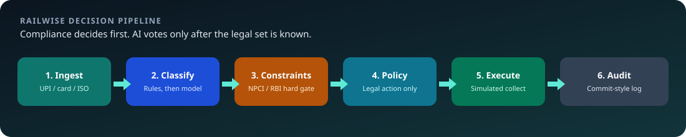
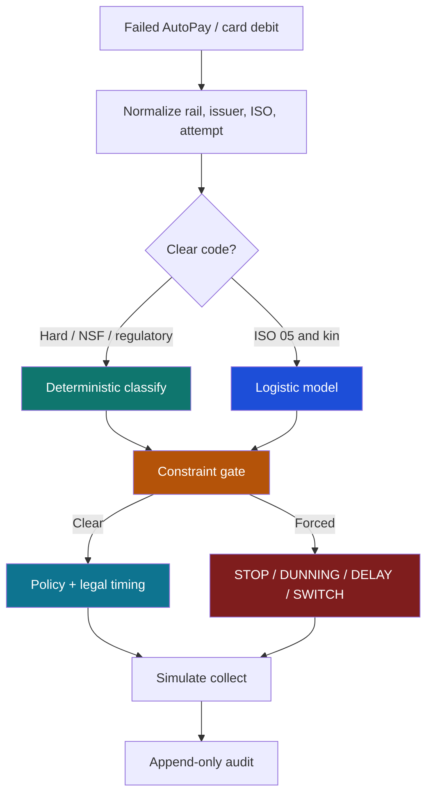
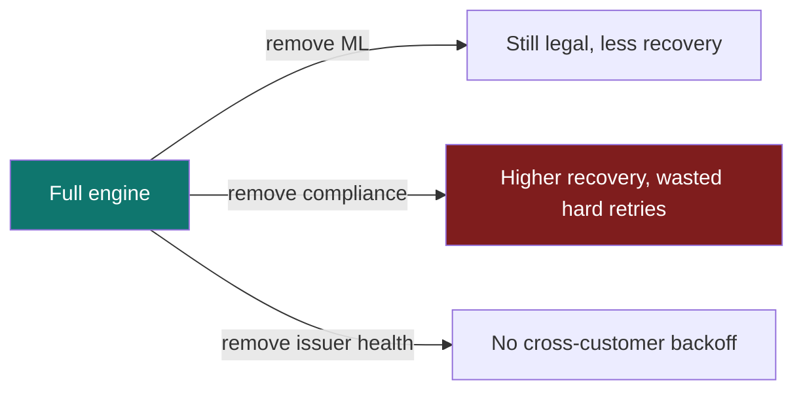

# Railwise

**Constraint-first recovery for failed UPI AutoPay and card recurring debits.**

<p align="center">
  
</p>

<p align="center">
  <a href="https://razorpay.com/buildathon/"></a>
  
</p>

<p align="center">
  
  
  
  
  
  
  
</p>

When a monthly AutoPay fails, the next click is not obvious. Retrying too soon can break NPCI rules. Retrying a stolen-card code wastes an attempt and can attract scheme fines. Waiting when SBI is having a technical spike can save the debit. Treating every `do_not_honor` the same way treats SBI and HDFC as if they were the same bank.

Railwise is a decision engine for that moment. It sits after the failure webhook and chooses one bounded action: retry now, delay, switch rail, dun the customer, or stop. **Rules write the legal set. A small logistic model may vote only after that set is known.**

This repository is a complete, runnable demonstration: engine, tests, trained weights, and a live control panel. It does not move live money.

---

## What problem this solves

India's recurring stack is not a generic "retry later" problem. Three public facts set the shape of the work.

**AutoPay is now large, and a large share of presentations still fail.** NPCI publishes bank-wise AutoPay execution with approved, business-decline (BD), and technical-decline (TD) shares. Reporting through 2025–26 shows AutoPay volumes heading toward a billion presentations a month, while approval at several issuers stays well below half. Most of those misses are BD: insufficient funds, limits, revoked or stale mandates. TD is smaller, but it clusters when an issuer is under load. See NPCI's [UPI AutoPay product page](https://www.npci.org.in/what-we-do/upi-autopay/product-overview) and compiled execution tables such as [Dataful's NPCI AutoPay series](https://dataful.in/datasets/22491/).

**Razorpay already recovers a meaningful slice of those failures.** Public product copy states that Intelligent Retry recovers **8% more debit collections** over a static baseline, using NPCI-legal windows (1 original + 3 retries) and payday / off-peak timing. See [UPI Autopay](https://razorpay.com/upi-autopay/), [Intelligent Revenue-Protect](https://razorpay.com/blog/upi-autopay-with-intelligent-revenue-protect/), and [subscription retry docs](https://razorpay.com/docs/payments/subscriptions/payment-retries/). Railwise does not replace that layer. It deepens the *decision* after a fail: rail-specific ceilings, issuer-wide backoff, mandate vitality, and an auditable call on ambiguous ISO codes.

**The legal surface is specific, not generic ML.** RBI's [Digital Payments – E-mandate Framework, 2026](https://www.rbi.org.in/Scripts/NotificationUser.aspx?Id=13374&Mode=0) requires a pre-transaction notice at least 24 hours before debit ([press release](https://www.rbi.org.in/Scripts/BS_PressReleaseDisplay.aspx?prid=62594)). Card recurring runs on [Card-on-File Tokenisation](https://rbi.org.in/Scripts/NotificationUser.aspx?Id=12159), not stored PANs. Amounts above the AFA threshold need customer auth. UPI AutoPay has a hard presentation budget. ISO 8583 still names the decline: `51` NSF, `05` do not honor, `91` issuer inoperative, `R0`/`R1` customer stopped recurring ([ISO 8583](https://www.iso.org/standard/31650.html)).

The gap Railwise fills is the lattice between those rules: same code, different issuer; same recoverability, exhausted budget; same customer, dead mandate.

<p align="center">
  
</p>

---

## How a failure is decided

One failed payment enters. Six stages run. The output is a single action plus a commit-style log.



| Stage | What it does | AI? |
|---|---|---|
| Ingest | One schema for UPI and card webhooks | No |
| Classify | Soft / hard / regulatory / ambiguous | Only if the code is ambiguous |
| Constraints | 13 NPCI / RBI / scheme ceilings | Never |
| Policy | Pick among remaining legal actions | Timing rank only |
| Execute | Deterministic simulated collection | No |
| Audit | Reason chain, features, guideline | No |

**Compliance always beats recoverability.** If the UPI budget is gone, a 0.78 score still cannot place another debit. That is the product.

<p align="center">
  
</p>

---

## Where AI is used, and why this model

Most of the engine is tables and thresholds. AI appears in two places.

**1. Ambiguous decline classifier.** ISO `05` / `do_not_honor` is not one event. On a high-TD issuer with no hard history it is often a technical reject. On a low-TD issuer with prior hard declines it is often a fraud-engine reject. A linear model can encode that. A language model cannot be audited by a compliance officer in JSON.

We use **pure-Python logistic SGD** (`backend/data/models/ambiguous_clf.json`):

- 15 features (rail, attempt, recovery history, issuer one-hots, amount, consecutive failures)
- Class-balanced updates, Polyak averaging, calibrated threshold
- Feature importance = `|weight × value|` on the live event
- No scikit-learn, no XGBoost, no GPU, no binary blob

Why this model and not a larger one: the label is a domain rule, the feature space is small, and the judge must read the weights. Seed-stable accuracy in the **89–92%** band is enough. A transformer would hide the reason.

**2. Recoverability**, derived from the same probability, not a second black box.

**Not AI:** issuer health (sliding-window TD rate vs NPCI-style baselines), mandate vitality (weighted consecutive-failure rules), UPI cooldown, attempt budget, PDN, CoFT, R0/R1, kill switch.

Training data is **synthetic and NPCI-calibrated**. Real Razorpay customer payloads are PII and are not in this repo. If production webhooks were available, the architecture would stay; only the training distribution would change.

---

## Measured results

All numbers below are from this repo, not marketing copy. Re-run them with the commands in [Run it](#run-it-on-your-machine).

### Locked classifier (seed 7, 6 000 train / 1 000 test)

| Metric | Value |
|---|---|
| Accuracy | **90.7%** |
| Soft recall | **91.3%** |
| Hard recall | **89.4%** |
| Decision threshold | 0.55 |
| Training stability (5 seeds) | **90.0% ± 0.4%** |
| Eight-seed sweep | **90.3% ± 0.6%** (min 89.4%, max 91.6%) |

Accuracy moves by about one point when the seed changes. That is the lock we wanted: a reviewer can retrain and still land near 90%.

### 500-event A/B batch (seed 2025)

| Metric | Railwise | Static schedule | Delta |
|---|---|---|---|
| Soft recovery | **51.2%** | 33.8% | **+17.4 pp** |
| Amount recovered | **₹13,64,293** | ₹9,77,873 | **+₹3,86,420** |
| Hard wasted retries | **0** | 91 | 91 illegal / useless hits avoided |
| UPI cooldown violations | **0** | 36 | NPCI gap held |
| Audit coverage | **100%** | 100%* | Railwise stores the constraint chain |

\*Static policy logs the action. It does not store why a ceiling fired.

Railwise-only protections on the same batch: **14** pre-debit blocks, **4** expired-token dunnings, **10** vitality dunnings, **135** issuer backoffs, **9** customer-cancelled stops.

### Multi-seed stability (15 × 500)

| | |
|---|---|
| Soft-rate wins | **15 / 15** |
| Average lift | **+18.6 pp** |
| Lift σ | **2.4 pp** |
| Railwise hard waste | **0 on every seed** |
| Railwise UPI violations | **0 on every seed** |
| Soft recovery mean | 53.0% ± 1.8% |

Lift is large and stable. Variance is a few points, not a collapse on an unlucky seed.

### Ablation (200 events, seed 42)

Turning a layer off is the honest test of whether the layer earns its place.

| Variant | Soft recovery | Hard waste | What it shows |
|---|---|---|---|
| Full Railwise | 59.9% | **0** | Target |
| No ML | 48.7% | 0 | Classifier adds recoverability on ambiguous codes |
| No compliance | 61.2% | **7** | Recovery can rise while the engine starts burning hard declines |
| No issuer health | 60.5% | 0 | Backoffs drop to 0; herd protection is gone |
| Rules + timing only | 57.7% | 0 | Legal, but weaker on ambiguous codes |

The important row is **no compliance**. A higher recovery number with wasted hard retries is not a win.



---

## What you see in the dashboard

Six views, one engine.

| View | What it is |
|---|---|
| **Recovery Journey** | One customer, one mandate, checkout → fail → decision log |
| **Overview** | 500-failure batch, KPIs, issuer health, live failure cards |
| **Sandbox** | Toggle ML / compliance / issuer / vitality / timing on one fixture |
| **Stability** | Many seeds, lift bars, zero-violation check |
| **Model Lab** | Train live, accuracy, weights, AI vs rules map |
| **Edge Cases** | Named India fixtures with expected actions |

On the journey failure step, the **large card is that customer**. The small cards on the right are **other** failures from the same batch (an ops queue), not extra cards the customer saved.

---

## Tech stack

| Layer | Choice | Why |
|---|---|---|
| Engine | Python 3.12 | Readable constraint code, no extra ML runtime |
| API | FastAPI | Typed decide / batch / journey / train endpoints |
| Audit | SQLite, append-only | Replay a decision without rewriting history |
| Model | Logistic SGD in-repo | Weights are JSON a human can open |
| UI | React 19 + TypeScript + Vite | Live cockpit, not a slide deck |
| Tests | pytest | 28 named edge cases + quality gate |

```
railwise/
  backend/engine/     normalize → classify → constraints → policy → execute → audit
  backend/data/       generator, fixtures, train_model.py, models/ambiguous_clf.json
  backend/app/        FastAPI + SQLite
  backend/tests/      edge-case contract tests
  frontend/src/       dashboard + Recovery Journey
  docs/               architecture, edges, demo script, security
  scripts/run.sh      one-command local boot
```

---

## Run it on your machine

Needs **Python 3.11+** (3.12 recommended) and **Node 18+**.

### One command

```bash
bash scripts/run.sh
```

API on `http://127.0.0.1:8000`, UI on `http://127.0.0.1:5173`.

### Two terminals

```bash
# Terminal 1
cd backend
python3.12 -m venv .venv   # or python3 -m venv .venv
source .venv/bin/activate
pip install -r requirements.txt
python data/train_model.py
uvicorn app.main:app --reload --port 8000

# Terminal 2
cd frontend
npm install
npm run dev
```

Open **http://localhost:5173**. Walk Recovery Journey, or run the A/B batch on Overview.

### Tests

```bash
cd backend && source .venv/bin/activate
pytest tests/edge_cases -q
```

Expect **28 passed**.

---

## How this improves existing recovery systems

Razorpay's Intelligent Retry and Intelligent Revenue-Protect already give merchants templates, legal retry caps, WhatsApp recovery, and published **+8% debit collections**. Railwise is the next decision lattice on top of that work:

1. **ISO 8583 + NPCI taxonomy** instead of a single retry / no-retry bit.
2. **Rail-aware budgets.** UPI and card do not share the same attempt math.
3. **Issuer Health Monitor.** When TD spikes across many customers of one bank, back off the herd instead of retrying everyone at once.
4. **Mandate Vitality.** Consecutive failures and days-since-success escalate a dying mandate to dunning before the last legal retry is spent.
5. **Hard compliance gate.** PDN, CoFT, R0/R1, AFA, UPI cooldown: the model cannot vote them away.
6. **Commit-style audit.** Every choice has a hash, a guideline, and (if AI ran) feature shares.

That is additive depth, not a claim that production retry is unused.

---

## Build challenges we actually hit

**Seed collapse on the classifier.** Early SGD runs sat at ~90% on lucky seeds and 62% on others (the model predicted almost everything hard). Cause: unscaled hours and amount features, plus a fixed 0.58 threshold. Fix: match train/serve feature scales, mild class weights, Polyak averaging, calibrate threshold in a tight band around 0.5. Result: 89–92% across seeds.

**Lift that never applied.** Timing lift checked `policy_name == "railwise"`, but live names are `railwise:ML+…`. Fix: `startswith("railwise")`. Batch lift became visible and stable.

**Journey that felt scripted.** First screens were fine; the pipeline page read like captions. Fix: live `/journey/run`, commit-hash log from the real `Decision`, Razorpay-shaped failure cards, batch feed as *other* tickets.

**Model Lab looking empty.** Training payload used a different variable than the UI expected. Fix: one `_build_training_payload` path.

**Honesty about data.** There is no legal public dump of Indian AutoPay webhooks with PII. We calibrated the generator to NPCI TD/BD structure and ISO maps, and we say so.

---

## References

Primary sources used to design constraints and to calibrate issuer behaviour:

1. NPCI, [UPI AutoPay](https://www.npci.org.in/what-we-do/upi-autopay/product-overview)
2. NPCI, [UPI product overview](https://www.npci.org.in/what-we-do/upi/product-overview)
3. NPCI-derived AutoPay execution (approved / BD / TD), [Dataful dataset 22491](https://dataful.in/datasets/22491/)
4. RBI, [Digital Payments – E-mandate Framework, 2026](https://www.rbi.org.in/Scripts/NotificationUser.aspx?Id=13374&Mode=0)
5. RBI, [press release, 21 April 2026](https://www.rbi.org.in/Scripts/BS_PressReleaseDisplay.aspx?prid=62594)
6. RBI, [Card-on-File Tokenisation (CoFT)](https://rbi.org.in/Scripts/NotificationUser.aspx?Id=12159)
7. RBI, [CoFT through issuing banks](https://www.rbi.org.in/Scripts/NotificationUser.aspx?Id=12573&Mode=0)
8. ISO, [ISO 8583 financial transaction card messages](https://www.iso.org/standard/31650.html)
9. Razorpay, [UPI Autopay + 8% Intelligent Retry](https://razorpay.com/upi-autopay/)
10. Razorpay, [UPI Autopay with Intelligent Revenue-Protect](https://razorpay.com/blog/upi-autopay-with-intelligent-revenue-protect/)
11. Razorpay, [Subscription payment retries](https://razorpay.com/docs/payments/subscriptions/payment-retries/)
12. Razorpay, [2026 AutoPay retry and off-peak guidance](https://razorpay.com/blog/master-recurring-payments-upi-autopay-guide/)

---

## Docs

| Doc | Contents |
|---|---|
| [Architecture](docs/ARCHITECTURE.md) | Pipeline, constraint order, modules |
| [Edge cases](docs/EDGE_CASES.md) | Named fixtures and expected actions |
| [Demo script](docs/DEMO_SCRIPT.md) | Five-minute walkthrough for the pitch video |
| [Security](docs/SECURITY.md) | Demo boundaries, idempotency, kill switch |

Pitch video will be linked here when it is recorded.

---

## License

Built for Razorpay AI Buildathon 2026. Educational and demonstration use. Synthetic events only. No live customer data and no live debit execution.
